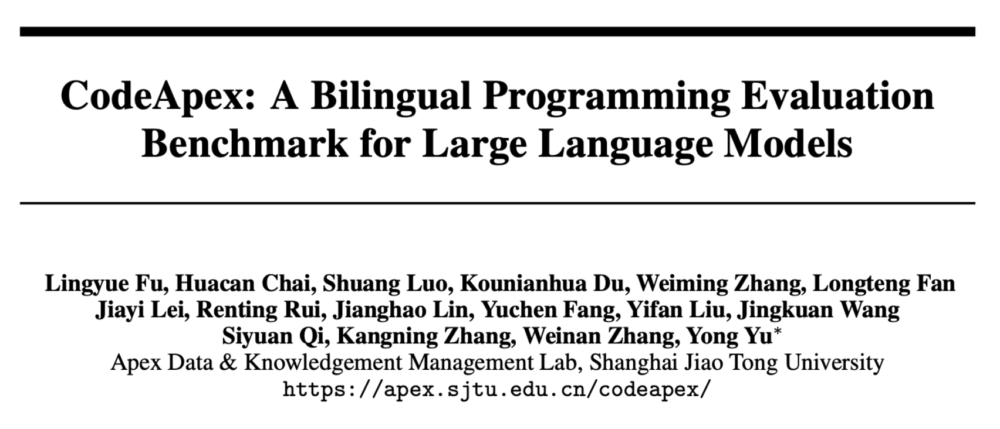
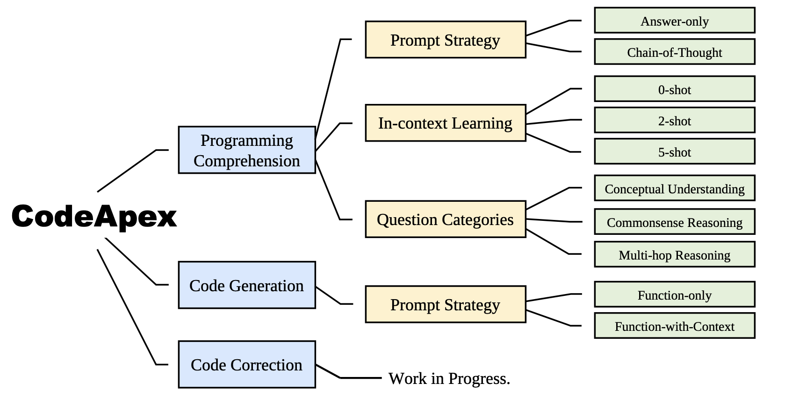

# 



CodeApex is a bilingual  programming evaluation benchmark for Large Language Models. It consists two basic programming tasks: programming comprehension and code generation. **Programming Comprehension Test** consists of 250 multiple choice quesitions, including conceptual understanding, commonsense reasoning, and multi-hop reasoning three question categories. **Code generation Task** consists of 476  C++ based algorithm problems, covering common algorithm knowledge points like binary search, depth-firsts-search and so on. In the future, CodeApex will publish other code-related functional tests, such as code correction.




### News

- [2023.09.05] CodeApex is published on arXiv and [Github](https://github.com/APEXLAB/CodeApex.git). [Benchmark website]((https://apex.sjtu.edu.cn/codeapex/)) is open for commission now.


### Table of Contents

- Leaderboard
- Data
- How to Evaluation on CodeApex
- How to Submit
- Licenses
- Citation


### Leaderboard

The public leaderboard is presented in [Leaderboard](https://apex.sjtu.edu.cn/codeapex/leaderboard/).

#### Programming Comprehension

| Model                    | AO-EN  | COT-EN | AO-ZH  | COT-ZH |
| ------------------------ | ------ | ------ | ------ | ------ |
| ChatGLM-6B               | 0.2960 | 0.2640 | 0.2960 | 0.2880 |
| ChatGLM-6B*              | 0.3200 | 0.2760 | 0.2960 | 0.2480 |
| ChatGLM2-6B              | 0.2987 | 0.2960 | 0.2987 | 0.3240 |
| ChatGLM2-6B*             | 0.3040 | 0.2960 | 0.3040 | 0.3360 |
| MOSS-16B*                | 0.3120 | 0.2360 | 0.3120 | 0.2240 |
| Chinese-Alpaca-7B        | 0.2947 | 0.2640 | 0.2880 | 0.2680 |
| Chinese-Alpaca-7B*       | 0.2840 | 0.2800 | 0.2840 | 0.2640 |
| Chinese-Alpaca-plus-7B   | 0.2987 | 0.2880 | 0.2653 | 0.3240 |
| Chinese-Alpaca-plus-7B*  | 0.2573 | 0.2480 | 0.2853 | 0.2400 |
| Chinese-Alpaca-13B       | 0.2733 | 0.2520 | 0.2733 | 0.2640 |
| Chinese-Alpaca-13B*      | 0.2547 | 0.2160 | 0.2627 | 0.2640 |
| Chinese-Alpaca-plus-13B  | 0.2827 | 0.2560 | 0.2827 | 0.2600 |
| Chinese-Alpaca-plus-13B* | 0.2973 | 0.2560 | 0.2573 | 0.2920 |
| BELLE-7B-1M              | 0.3080 | 0.2120 | 0.2947 | 0.2720 |
| BELLE-7B-1M*             | 0.3040 | 0.1840 | 0.3013 | 0.2600 |
| BELLE-7B-2M              | 0.2613 | 0.2040 | 0.2760 | 0.2240 |
| BELLE-7B-2M*             | 0.2400 | 0.1880 | 0.2413 | 0.2400 |
| BELLE-LLaMA-7B-0.6M      | 0.2880 | 0.2320 | 0.3053 | 0.2760 |
| BELLE-LLaMA-7B-0.6M*     | 0.3000 | 0.2600 | 0.3000 | 0.3200 |
| BELLE-LLaMA-7B-2M        | 0.2680 | 0.1880 | 0.2387 | 0.2640 |
| BELLE-LLaMA-7B-2M*       | 0.2840 | 0.1880 | 0.2840 | 0.2800 |
| BELLE-LLaMA-13B-2M       | 0.2840 | 0.2120 | 0.2840 | 0.2560 |
| BELLE-LLaMA-13B-2M*      | 0.2693 | 0.2120 | 0.2827 | 0.2600 |
| InternLM-Chat-7B         | 0.3733 | 0.3160 | 0.3720 | 0.2880 |
| Baichuan-7B              | 0.3147 | 0.1000 | 0.3147 | 0.0720 |
| EduChat-base-002-7B*     | 0.3147 | 0.2360 | 0.2480 | 0.2480 |
| EduChat-base-002-13B*    | 0.3267 | 0.2680 | 0.3013 | 0.2800 |
| EduChat-sft-002-7B*      | 0.2920 | 0.2560 | 0.2560 | 0.2520 |
| CodeT5-plus-16B          | 0.2640 | -      | 0.2640 | -      |
| CodeT5-plus-16B*         | 0.2467 | -      | 0.3160 | -      |
| CodeT5-plus-6B           | 0.3173 | -      | 0.2693 | -      |
| CodeT5-plus-6B*          | 0.3040 | -      | 0.2573 | -      |
| GPT-3.5-turbo            | 0.4893 | 0.4740 | 0.4893 | 0.5260 |
| GPT-3.5-turbo*           | 0.4413 | 0.4853 | 0.5053 | 0.5187 |

#### Code Generation

|                         | ZH             | ZH       | ZH         | ZH          | EN             | EN       | EN         | EN          |
| ----------------------- | -------------- | -------- | ---------- | ----------- | -------------- | -------- | ---------- | ----------- |
| **Model**               | **Compilable** | **AC@1** | **AC@all** | **AC Rate** | **Compilable** | **AC@1** | **AC@all** | **AC Rate** |
| GPT-3.5-turbo           | 0.9118         | 0.6660   | 0.4853     | 0.5644      | 0.8929         | 0.6597   | 0.4832     | 0.5606      |
| MOSS-16B                | 0.5231         | 0.2458   | 0.1492     | 0.1879      | 0.6092         | 0.2626   | 0.1513     | 0.2002      |
| vicuna-13B              | 0.7983         | 0.3046   | 0.1492     | 0.2045      | 0.7815         | 0.2983   | 0.1218     | 0.1861      |
| ChatGLM-6B              | 0.5693         | 0.2143   | 0.0924     | 0.1371      | 0.6429         | 0.2080   | 0.0693     | 0.1203      |
| ChatGLM2-6B             | 0.5399         | 0.2143   | 0.1197     | 0.1560      | 0.5399         | 0.1891   | 0.0819     | 0.1243      |
| Chinese-alpaca-plus-13B | 0.7164         | 0.2773   | 0.1387     | 0.1886      | 0.7017         | 0.2878   | 0.1345     | 0.1963      |
| BELLE-7B-1M             | 0.4244         | 0.1639   | 0.0651     | 0.0954      | 0.5273         | 0.2038   | 0.0651     | 0.1161      |
| BELLE-LLaMA-13B-2M      | 0.5105         | 0.1996   | 0.0903     | 0.1283      | 0.5357         | 0.2227   | 0.0861     | 0.1434      |
| WizardCoder-15B         | 0.8634         | 0.4496   | 0.2773     | 0.3468      | 0.8361         | 0.4391   | 0.2752     | 0.3444      |
| Starcoder-self-instruct | 0.4853         | 0.2227   | 0.1366     | 0.1679      | 0.6765         | 0.3382   | 0.1891     | 0.2494      |
| Baichuan-Chat-13B       | 0.6218         | 0.3130   | 0.1786     | 0.2303      | 0.7605         | 0.3319   | 0.1681     | 0.2310      |
| InternLM-chat-7B        | 0.4265         | 0.1513   | 0.0924     | 0.1128      | 0.7626         | 0.3025   | 0.1597     | 0.2126      |

### Data

Test data are published in this repo. 

First, clone the this repo:

```
git clone https://github.com/SJTU-LIT/ceval.git
```

The data is in Programming_Comprehension/testcases and Code_Generation/testcases, whose format is json.

The format of programming comprehension is:

```
[
    {
        "question": "If there is a definition: char str[] = {'h','1','2','0','a','b'}; const char *p = str; Which of the following statements is correct:____\n",
        "A": "p[2] = 's'",
        "B": "strcpy(str,\"123456\")",
        "C": "strcpy(p,\"abc\")",
        "D": "strcpy(str,\"abc\")",
        "category": 1,
        "id": 0
    },
    ...
]
```

The format of code generation is:

```

```


### How to Evaluation on CodeApex

#### Programming Comprehension

You can evaluate your model's response on our [website](https://apex.sjtu.edu.cn/codeapex/). Users should be responsible for the correctness and compliance of their inputs. The format of answer generated by LLM is json, and the json file is divided into three dictionaries in order, representing the answers for CU, CR, and MCR, with each dictionary's answers sorted by ID within the dictionary. We provide an example *example.json*. Your input should be a npy file containing your answer to the testcases, and run the deal_answer.py to generate the json file for evaluation.

[How to submit?](https://github.com/APEXLAB/CodeApex/blob/main/Programming_Comprehension/eval/README.md)

#### Code Generation

Online evaluation of code generation tasks is being set up. Coming soon.


### Citation

### 
